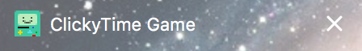
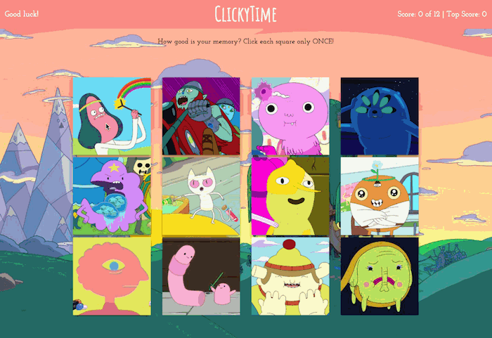

<h1 align="center">ClickyTime</h1>

Adventure Time-themed memory game, built with React. Mathematical!

## Deployed Application

[GitHub Pages] <https://g33klaura.github.io/clickytime/>

<!-- Use extension to make TOC -->
<!-- ## Contents -->

## Concept

The goal of the game is to click each character image only once.

## Technologies Used

React, JSX, Materialize CSS, React-Materialize and React-Flip-Move packages

## Key Features

* React "shuffle" animation of game squares
* Componitized page elements
* Dynamic scoring and messaging
* Responsive design
* BMO favicon  

### Application Process

1. Click any square to begin
1. Images will shuffle into random position when clicked
1. Click a different image until all characters have been selected once
1. Lose the game if you click any image twice
1. Player's top score will update after each lost game

### Gameplay

(If gifs aren't animating, please try clicking them to view by themselves)

###### Losing Game

###### Winning Game

*Enjoy! (It's harder than it looks!)* :lollipop: :sparkles: :lemon: